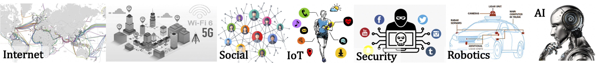

# {{ site.tagline }}

<!-- {: .mb-2 } {: .fs-6 .fw-300 } -->

## Logistics

#### Lectures
Mondays & Wednesdays, 11:00am – 11:50am 

[Join Zoom Lecture]({{ site.aux_links.zoom_lec.link}}){: .btn .btn-outline }  
Meeting ID: `892 9141 3832` Password: `269962`

[See Lecture Schedule](#calendar){: .btn .btn-outline } 

#### Labs
Fridays, 10:00am – 11:50am

[Join Zoom Lab]({{ site.aux_links.zoom_lab.link}}){: .btn .btn-outline }  
Meeting ID: `892 9141 3832` Password: `269962` (same as lectures)

#### Office Hours
TBA

---

## Recent Announcements



  {{ announcement }}

[See All Announcements](#all-announcements){: .btn .btn-outline }

---
## Calendar
<!--  -->

---

## Course Staff


---

## Syllabus


---

## Exam Information


---

## Grading Information


<!-- ---
## Midterm Exam Information
 -->

---
## All Announcements

  {{ announcement }}

